# Инстаграм филтри

## 1. ОПИС НА АПЛИКАЦИЈАТА

Инстаграм филтри е апликација напишана во _Python_ програмскиот јазик со помош
на _OpenCV_ библиотеката. Имплементирана е по модел на стварните филтри кои што ги
содржи популарната апликација Инстаграм. Некои од филтрите имплементирани се:
_Clarendon_, _Gingham_, _Reyes_, _Amaro_, _Inkwell_, _Nashville_, _Toaster_ и други. Апликацијата освен
алгоритмите за обработување на фотографии, тн. филтри, овозможува и креирање на
модифицирани филтри од страна на корисникот. Филтрите комбинираат неколку
функции како што се функција за подесување на светлина и контраст, избор на бои и
заситеноста, односно незаситеноста, менување на простори на бои со други бои,
додавање транспарентни слоеви.
Изгледот на апликацијата представен е на следната слика:

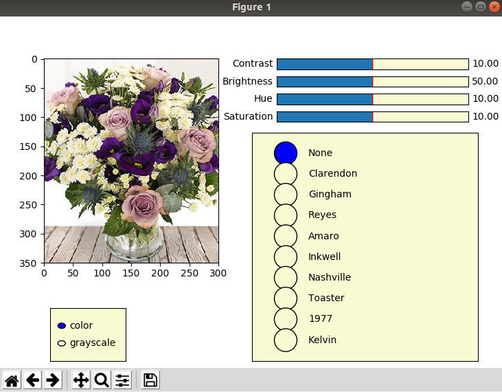

Освен _OpenCV_ библиотеката за работа со фотографии, во проектот користени се и
библиотеките: _Numpy_ – библиотека за математички пресметувања и функции и
_Matplotlib_ – библиотека за графички приказ на фигури. За графичкиот приказ на
елементи како Radio buttons и Sliders дополнително е користена библиотеката
_Myplotlib.widgets._


## 2. КОРИСТЕНИ АЛГОРИТМИ

### 2.1. OpenCV функционалности

```
За имплементација на функционалностите на Инстаграм-филтри апликацијата,
користени се некои од готови функции од библиотеката OpenCV, како што се:
```
- **imread()** – читање на слика
- **cvtColor()** – за претворање на слика од еден вид во друг, нпр.
    o img_hsv = cv2.cvtColor(img_rgb, cv2.COLOR_BGR2HSV) –
       претворање од RGB формат во HSV формат на слика
    o img_gray = cv2.cvtColor(img, cv2.COLOR_BGR2GRAY) – претворање
       од RGB формат во Grayscale
- **addWeighted()** – за собирање на две слики, нпр.
    o res = cv2.addWeighted(img,1-a,color,a,0) – собирање на две слики,
       img и color

### 2.2. Алгоритми од апликацијата

```
За трансформација на сликите користени се следните функции:
```
- **hue_saturation** (img_rgb, alpha = 1, beta = 1) – функција за менување на
    заситеноста и просторот на боите на слика

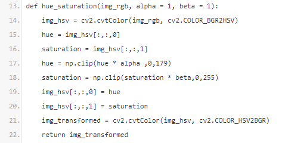

- **brightness_contrast** (img, alpha = 1.0, beta = 0) – функција за менување на
    контраст и светлина на слика

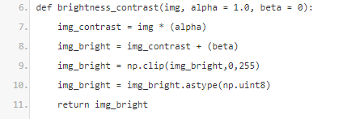

- **grayscale** (img) – функција за претворање на слика од RGB формат во
    Grayscale 

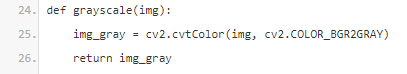

- **vignette** (img,r,g,b,a) – функција за додавање на транспарентен слој врз
    сликата 

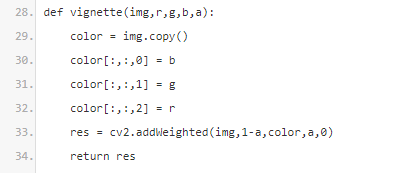

- **replace_color** (img,hl=0,sl=0,vl=0,hu=0,su=0,vu=0,nred=0,ngreen=0,nblue=0)
    – функција која што заменува одреден простор на боја со друга боја;
    Прво се претвора сликата во HSV формат, а потоа ги одредуваме
    границите на бојата која што сакаме да ја смениме, така добиваме слика
    која што има вредност нула на сите пиксели кои што не се во границите
    на дадената боја. Сега е лесно да ги смениме вредностите со новата боја

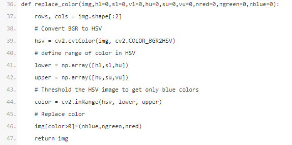

## 3. ИМПЛЕМЕНТАЦИЈА НА ФИЛТРИТЕ

Целта на апликацијата е да се постигне сличност со постоечките филтри на
Инстаграм апликацијата. Во овој дел ќе се објасни како е тоа постигнато, со функциите
од претходниот дел.
Имплементираните филтри од Инстаграм во оваа апликација се:

_- Clarendon_, _Gingham_, _Reyes_, _Amaro_, _Inkwell_, _Nashville_, _Toaster_, _1977_ и _Kelvin_

### 3.1. Clarendon

```
За постигнување на сличноста на Clarendon филтерот беа потребни неколку
ставки:
```
- Зголемување на контрастот на 120%
- Намалување на светлината на 70%
- Зголемување на заситеноста на 125%

```
Повик на функцијата:
```

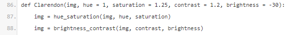

Резултат од трансформацијата на Clarendon филтерот:

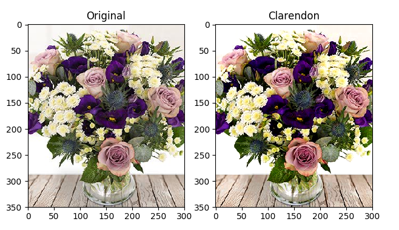

### 3.2. Gingham

```
За постигнување на сличноста на Gingham филтерот беа потребни неколку
ставки:
```
- Зголемување на контрастот на 110%
- Намалување на светлината на 80%
- Намалување на заситеноста на 90%
- Зголемување на бои на 110%

```
Повик на функцијата:
```

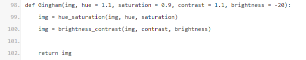

Резултат од трансформацијата на Gingham филтерот:

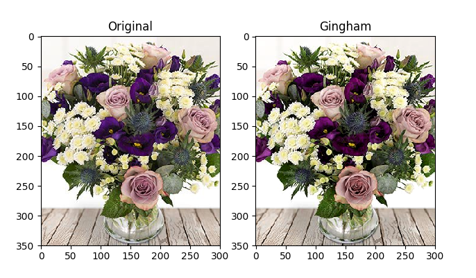

### 3.3. Reyes

```
За постигнување на сличноста на Reyes филтерот беа потребни неколку ставки:
```
- Намалување на контрастот на 90%
- Зголемување на светлината на 110%
- Намалување на заситеноста на 75%
- Зголемување на бои на 120%

```
Повик на функцијата:
```

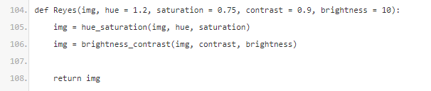

Резултат од трансформацијата на Reyes филтерот:

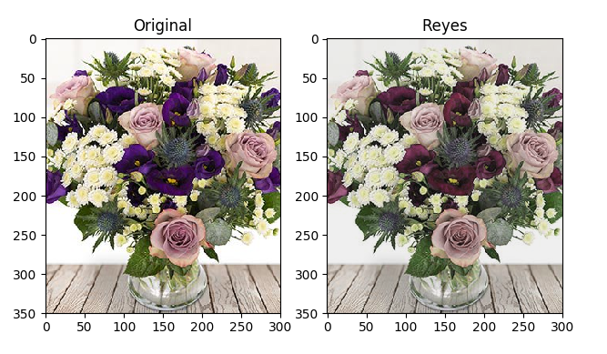

### 3.4. Amaro

```
За постигнување на сличноста на Amaro филтерот беа потребни неколку ставки:
```
- Намалување на контрастот на 90%
- Зголемување на светлината на 110%
- Зголемување на заситеноста на 150%
- Зголемување на бои на 110%

```
Повик на функцијата:
```

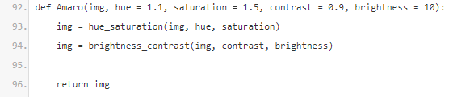

Резултат од трансформацијата на Amaro филтерот:


### 3.5. Inkwell

```
За постигнување на сличноста на Inkwell филтерот беа потребни неколку
ставки:
```
- Зголемување на контрастот на 130%
- Намалување на светлината на 70%
- Претворање на сликата во grayscale формат

```
Повик на функцијата:
```

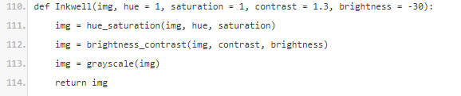

Резултат од трансформацијата на Inkwell филтерот:

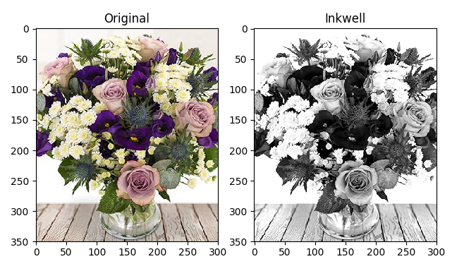

### 3.6. Nashville
```
За постигнување на сличноста на Nashville филтерот беа потребни неколку
ставки:
```
- Зголемување на контрастот на 120%
- Зголемување на светлината на 110%
- Зголемување на заситеноста на 150%
- Замена на црна боја со индиго
- Замена на бела боја со портокалова

```
Повик на функцијата:
```

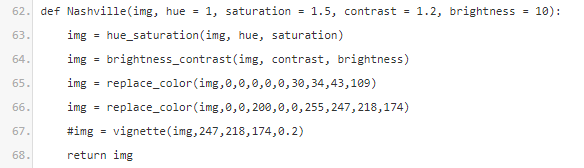

Резултат од трансформацијата на Nashville филтерот:

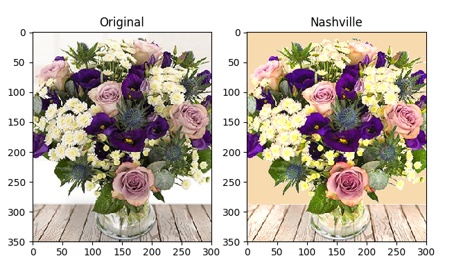

### 3.7. Toaster

```
За постигнување на сличноста на Toaster филтерот беа потребни неколку
ставки:
```
- Зголемување на контрастот на 140%
- Намалување на светлината на 80%
- Намалување на заситеноста на 90%
- Додавање 10% транспарентен слој портокалова боја
- Додавање на 30% транспарентен слој жолта боја

```
Повик на функцијата:
```

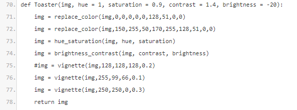

Резултат од трансформацијата на Toaster филтерот:

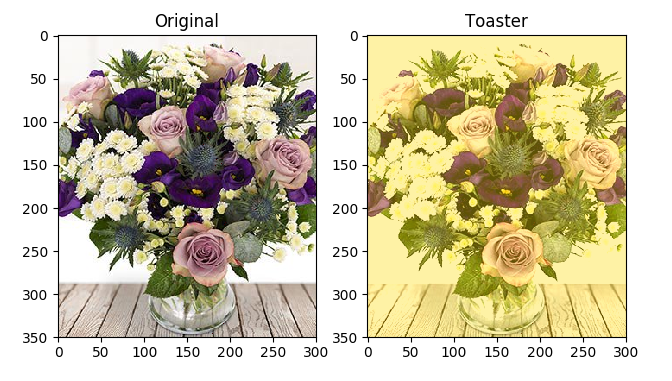

### 3.8. 1977

```
За постигнување на сличноста на 1977 филтерот беа потребни неколку ставки:
```
- Зголемување на контрастот на 110%
- Намалување на светлината на 70%
- Зголемување на заситеноста на 130%
- Додавање 30% транспарентен слој розева боја

```
Повик на функцијата:
```

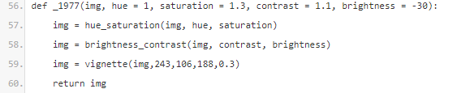

Резултат од трансформацијата на 1977 филтерот:

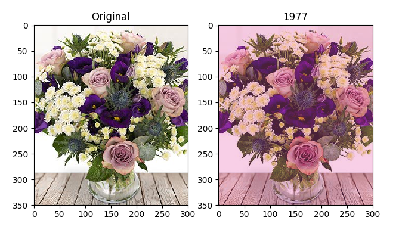

### 3.9. Kelvin

```
За постигнување на сличноста на Kelvin филтерот беа потребни неколку ставки:
```
- Зголемување на контрастот на 130%
- Зголемување на светлината на 110%
- Зголемување на заситеноста на 150%
- Зголемување на боите на 120%
- Додавање 10% транспарентен слој жолта боја

```
Повик на функцијата:
```

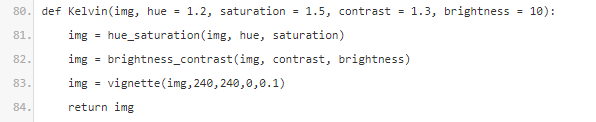

Резултат од трансформацијата на Kelvin филтерот:

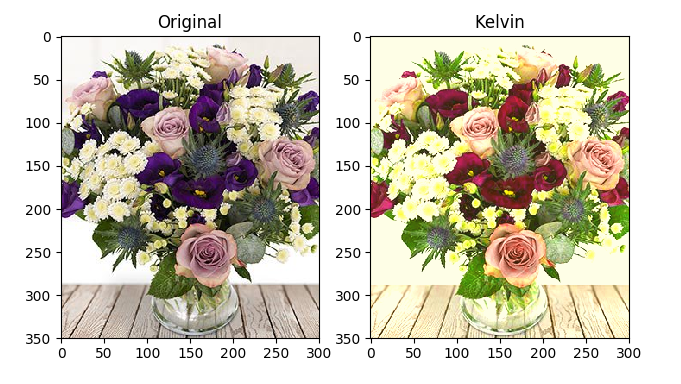


Изработила: Јелена Микан
